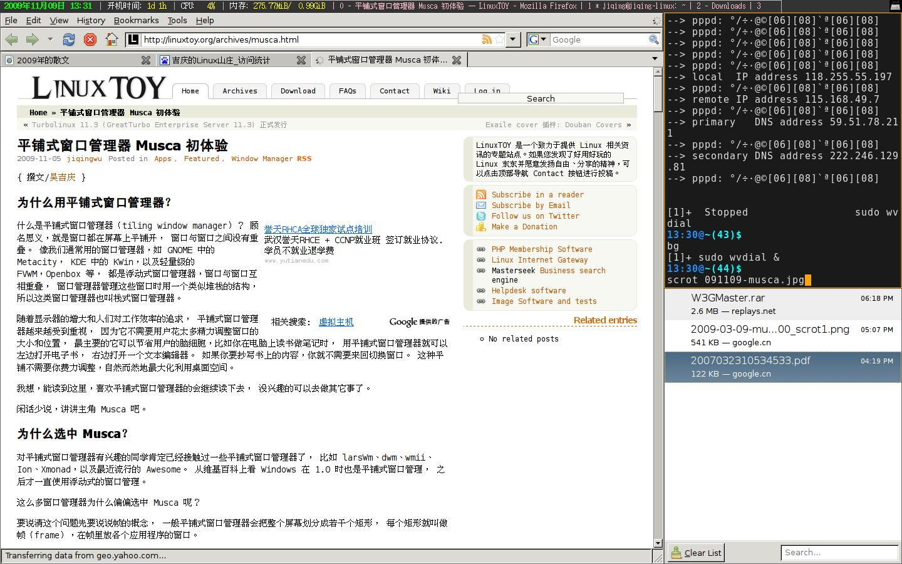
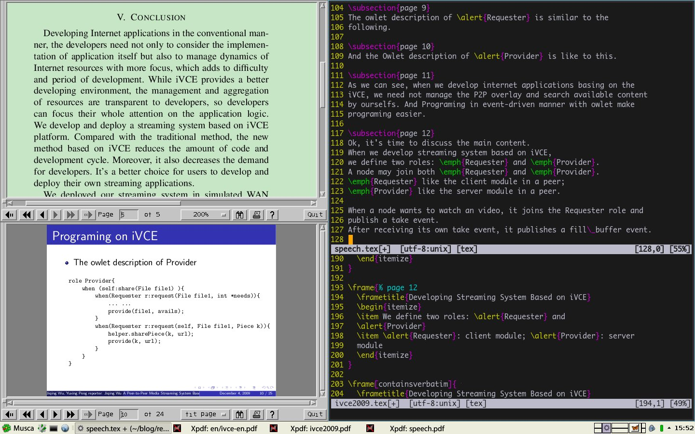

=====================================
最小主义：我的Musca桌面环境
=====================================

:author: jiqing Wu
:email: jiqingwu@gmail.com
:mainpage: http://hi.baidu.com/jiqing0925

我现在有一个非常简单实用的桌面环境了：Musca + conky + trayer。

当然Musca运行时需要dmenu，其实也不是非dmenu不可，据说 *dzen* 也不错。
我现在用的是dmenu。

先放一张我的桌面截图吧。

我的Musca配置
=================================

Musca_ 是我最近发现的非常喜欢的平铺式窗口管理器。
对于它的安装和使用我已经在 这里_ 做了介绍。
今天主要介绍一下它的配置，
也就是在 `.musca_start` 中写了哪些让musca启动后执行的命令：

::

  # 告诉musca不要管理conky和trayer的窗口
  manage off trayer
  manage off Conky
  
  # 启动conky和trayer
  exec conky
  # 为了方便在网页中显示，我把trayer的命令拆为3行，
  # 请复制后拼接为一行
  exec trayer --edge top --align right --widthtype request
  --height 20 --SetDockType true --transparent true
  --alpha 255 --tint 0x00ff00
  
  # 设定聚焦帧的边框颜色为橘黄，我喜欢的颜色
  set border_focus Orange
  # 如果有空帧，则新启动的程序会自动在空帧中打开，这点很方便
  set window_open_frame empty
  # 不需要单击，鼠标经过的时候窗口就聚焦
  set focus_follow_mouse 1
  # 设置dmenu的启动命令，我用的是自己编译的支持xft的dmenu
  set dmenu /usr/local/bin/dmenu -i -b -fa Sans-12 -p $
  
  # 因为我没有xterm，所以重新绑定Mod4+t启动系统的默认终端
  bind off Mod4+t
  bind on Mod4+t exec x-terminal-emulator
  # 按Mod4+q退出musca，不知道为什么不管用
  bind on Mod4+q quit
  # 按Mod1(我这里是Alt) + 方向键移动选定的窗口
  bind on Mod1+Left slide left
  bind on Mod1+Right slide right
  bind on Mod1+Up slide up
  bind on Mod1+Down slide down

  # 按Mod4 + 数字键快速地切换工作组
  bind on Mod4+1 use 0
  bind on Mod4+2 use 1
  bind on Mod4+3 use 2
  bind on Mod4+4 use 3
  bind on Mod4+5 use 4
  
  # 确定每个工作组的活跃范围，屏幕上留出20像素给conky和trayer
  pad 0 0 20 0
  hook on ^add pad 0 0 20 0
  # 添加一个叫web的工作组，并加载我导出的窗口布局，上网用
  add web
  load .mweb
  # 切换到原来第一个工作组
  use 0
  load .mdefault

.. _这里: Musca_
.. _Musca: http://linuxtoy.org/archives/musca.html

配合Musca的conky配置
==================================

大家可以看到我的conky中显示了当前工作组的窗口列表，
这个怎么实现的呢？
conky自己能通过 `${exec cmd}` 显示cmd的输出。
而我们能通过 `musca -c 'show windows'` 输出当前组的窗口列表，
但是输出的格式是每个窗口一行，这不是我们想要的，
我们可以通过awk，对这个字符串处理一下。
综合起来是：
`${exec musca -c 'show windows'|awk '{printf " | %s",$0}'}`

为了方便大家参考，我将我整个的conky配置文件贴在下面。

::

  # jiqing's conky configuration
  
  # set to yes if you want Conky to be forked in the background
  background no
  
  # 使用xft字体
  use_xft yes
  # 默认的xft字体
  xftfont Sans:size=10
  # Text alpha when using Xft
  xftalpha 1.0
  
  # 每8秒更新一次
  update_interval 8.0
  
  # 更新的次数，设为0是永远更新
  total_run_times 0
  
  # 使用桌面，不用自己的窗口
  own_window no
  
  # If own_window is yes, you may use type normal, desktop or override
  own_window_type desktop
  # Use pseudo transparency with own_window?
  own_window_transparent yes
  # If own_window_transparent is set to no, you can set the background colour here
  own_window_colour black
  
  # If own_window is yes, these window manager hints may be used
  #own_window_hints undecorated,below,sticky,skip_taskbar,skip_pager
  
  # 使用双缓冲，避免闪烁
  double_buffer yes
  
  # Minimum size of text area
  minimum_size 500 18
  maximum_width 1340
  
  # Draw shades?
  draw_shades no
  # Draw outlines?
  draw_outline no
  
  # 让conky有边框，我觉得这样酷一点
  draw_borders yes
  
  # Draw borders around graphs
  draw_graph_borders no
  
  # 边框用实线，不用点画线
  stippled_borders no
  
  # border margins
  border_margin 3
  
  # border width
  border_width 1
  
  # 定义一些颜色
  color0 white
  color1 yellow
  default_color gray73
  default_shade_color black
  default_outline_color black
  
  # Text alignment, other possible values are commented
  alignment top_left
  
  # Gap between borders of screen and text
  # same thing as passing -x at command line
  gap_x 0
  gap_y 2
  
  # Subtract file system buffers from used memory?
  no_buffers yes
  
  # set to yes if you want all text to be in uppercase
  uppercase no
  
  # number of cpu samples to average
  # set to 1 to disable averaging
  cpu_avg_samples 2
  
  # number of net samples to average
  # set to 1 to disable averaging
  net_avg_samples 2
  
  # Force UTF8? note that UTF8 support required XFT
  override_utf8_locale yes
  
  # Add spaces to keep things from moving about?  This only affects certain objects.
  #use_spacer none
  use_spacer left
  
  # Maximum size of buffer for user text, i.e. below TEXT line.
  #max_user_text 16384
  
  # Allow for the creation of at least this number of port monitors (if 0 or not set, default is 16) 
  #min_port_monitors 16
  
  # Allow each port monitor to track at least this many connections (if 0 or not set, default is 256)
  #min_port_monitor_connections 256
  
  # variable is given either in format $variable or in ${variable}. Latter
  # allows characters right after the variable and must be used in network
  # stuff because of an argument
  
  # stuff after 'TEXT' will be formatted on screen
  # 为了方便在网页中显示，我把conky输出的内容分为多行，
  # 如果你想像我一样在一行中显示，请把TEXT后的内容拼为一行
  
  TEXT
  ${font Bistream Vera Sans Mono:size=10:bold}${color green}
  ${time %Y年%m月%d日 %H:%M}$font $color
  |$color0 开机时间:$color1 $uptime_short $color
  |$color0 CPU:$color1 $cpu% $color
  |$color0 内存:$color1 $mem/$memmax
  ${font Sans:size=9}${color pink}
  ${exec musca -c 'show windows'|awk '{printf " | %s",$0}'} 

最后，说一点心得，其实手动平铺式窗口管理器并不是很难用，
大多数情况你都不需要使用浮动窗口模式，只要你合理安排窗口布局，
*gimp* 你都能用得很舒服。

2009年12月4日更新：
===================================================

用conky显示窗口列表并不是很好，经常显示不全。而且也不能像真的任务栏那
样操作。

pypanel也不行，根本不能显示窗口列表。

我还以为是Musca不符合MWM规范呢，但看到一个网友用tint2可以显示窗口列表。
他告诉我说，就pypanel不行，别的panel都可以。
原来这样，看来Musca都可以嵌入到gnome中用了，真的很不错啊。

我试用了tint2，基本满意，但是有两个问题：

1. 它对系统托盘程序的支持并不好。它对方形的托盘图标显示没问题，
   但是对于workrave这样的长矩形托盘也只能显示个方形，显示不全。
2. 用鼠标激活窗口时，任务栏上的窗口才显示被激活的状态，
   用快捷键激活窗口时，任务栏上所有的窗口都没有被激活的状态。

我于是试了下xfce4-panel，效果几乎完美。tint2的那两个问题都解决了。
而且对工作区的显示非常棒，你看截图右下角的工作区显示。
可能美中不足的就是它是xfce4的组件，不能独立安装。

